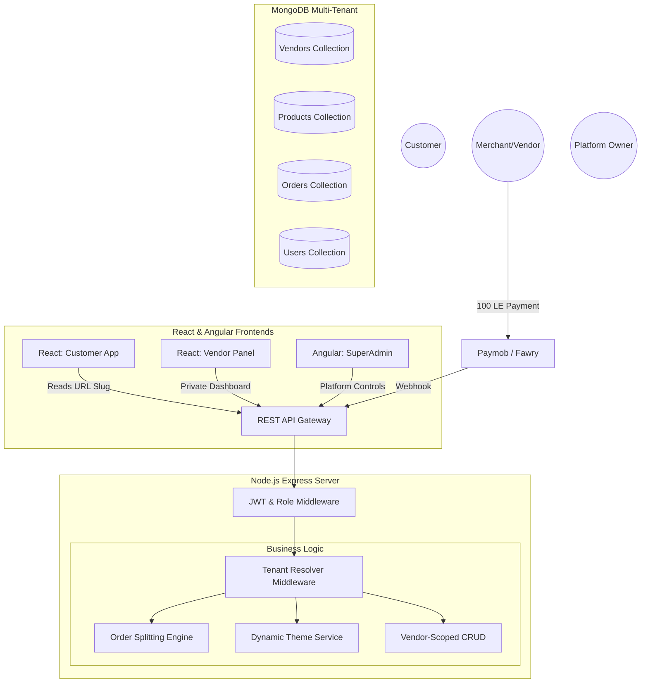
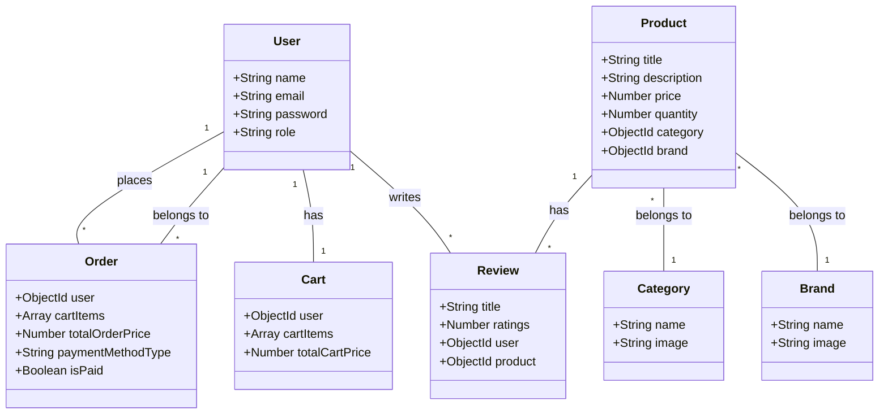
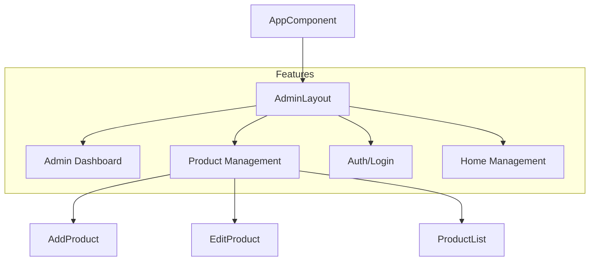

# Project Architecture Documentation

This document provides a visual and detailed overview of the coding project, covering the Node.js Backend, React Frontend, and Angular Admin Panel.

## 1. High-Level Architecture

The system consists of three main parts:
1.  **Backend (Node.js/Express)**: Serves the REST API and matches the database.
2.  **Frontend (React)**: The main customer-facing e-commerce application.
3.  **Admin Panel (Angular)**: The management dashboard for administrators.



---

## 2. Backend (Node.js)

**Location:** `/backend`

The backend is built with Node.js and Express, utilizing a centralized architecture with Routes, Controllers, and Models.

### Database Schema (Mongoose Models)



### API Routes Structure

The backend exposes the following main route groups:

*   **Auth**: `/api/v1/auth` (Login, Register)
*   **Users**: `/api/v1/users`
*   **Products**: `/api/v1/products`
*   **Categories**: `/api/v1/categories`
*   **Brands**: `/api/v1/brands`
*   **Orders**: `/api/v1/orders`
*   **Cart**: `/api/v1/cart`
*   **Reviews**: `/api/v1/reviews`
*   **Coupons**: `/api/v1/coupons`
*   **Chat**: `/api/v1/chat`

---

## 3. Frontend (React)

**Location:** `/frontend`

Built with React, Vite, and Redux for state management. It uses a component-based structure.

### Component Structure

```mermaid
graph TD
    App[App.jsx] --> Header
    App --> Footer
    App --> Router[Router / Routes]

    subgraph Pages/Components
        Router --> Home
        Router --> Auth[Auth (Login/Register)]
        Router --> Product[Product Details/Overview]
        Router --> Collection[Collection/Shop]
        Router --> Cart
        Router --> User[User Profile]
        Router --> Wishlist
        Router --> Checkout
    end

    Header --> Search
    Header --> NavLinks
    
    Home --> ImageSlider
    Home --> CategorySwiper
```

### Key Directories
*   `src/components`: Contains all UI components grouped by feature (Auth, Cart, Product, etc.).
*   `src/redux`: Redux slices and store configuration (likely for Cart, User, and Product state).
*   `src/apis`: API integration logic.

---

## 4. Admin Panel (Angular)

**Location:** `/Admin`

Built with Angular (standalone components structure), focused on management features.

### Feature Modules



### Key Directories
*   `src/app/core`: Core services and implementing singleton pattern logic.
*   `src/app/features`: Main business logic modules.
    *   `auth`: Admin authentication.
    *   `admin`: Dashboard and main administration tools.
    *   `product`: Product CRUD operations.
*   `src/app/layout`: Structural components like Sidebar, Navbar.
*   `src/app/shared`: Reusable components and pipes.
